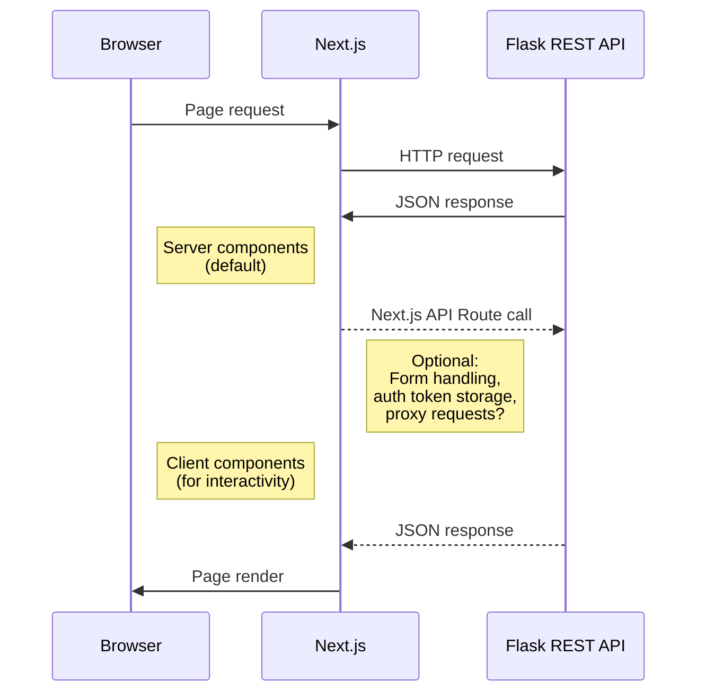

# Reddit Trend Analyzer

This is the frontend service for a web application that:
- fetches **trending Reddit topics**
- analyzes the **sentiment** of public discussions
- and enables **filtering topics by sentiment** (positive, negative, neutral)

> 🚧 This project is in early development.

## 🛠️ Tech Stack (Planned)

- **Language:** TypeScript
- **Framework:** Next.js   
- **UI library:** Shadcn/ui to utilize customizable components
- **API calls:** Axios

## Usage

Install dependencies:

```bash
npm install
```

Run the development server:

```bash
npm run dev
```
Configure requests to Flask REST API with getTopics function:
```typescript
async function getTopics(
    subredditName: string, 
    postType: string, 
    numberOfPosts: number): Promise<RedditTopic[]> {
    //...
};
```
Example request:
```typescript
const topics = await getTopics("programming", "hot", 100);
```
NOTE: At the moment using number of posts > 100 may cause fetch to timeout.

## Project structure suggestion
A best practice Next.js project structure by Binaya Bajracharya shared on [DEV Community](https://dev.to/bajrayejoon/best-practices-for-organizing-your-nextjs-15-2025-53ji) that we could follow:
```
src/
├── app/                   # App Router
│   ├── layout.tsx         # Root layout
│   ├── page.tsx           # Homepage
│   └── (routes)/          # Grouped routes
├── components/            # Shared components
│   ├── ui/                # UI components
│   └── features/          # Feature-specific components
├── lib/                   # Utility functions
├── hooks/                 # Custom React hooks
├── styles/                # Global styles
├── types/                 # TypeScript type definitions
└── context/               # React Context providers
```

## Next.js file based routing
For example:
```
app (rendered at route -> '/')
├── layout.tsx (required root layout)
├── page.tsx (UI rendered at a specific route)
|   
└── topics (rendered at route -> '/topics')
    ├── layout.tsx (optional for nested routes) 
    ├── page.tsx
    │
    └── [slug] (dynamically rendered at route -> '/topic/[slug]')
        └── page.tsx
```

## Server vs client components
Layouts and pages are server components by default. Data fetching and API connections can be executed using server components. It's best practice to use client components for components that require user interactivity involving state or event handlers e.g. onClick/onChange. Use client directive to declare component to rendered on the client side:
```typescript
"use client";
```

## Next.js docs

- [Next.js Documentation](https://nextjs.org/docs)

## Shadcn/ui components
- [shadcn/ui library components](https://ui.shadcn.com/docs/components)

Already installed and reusable shadcn components can be found at:
```
src 
└── components
    └── ui
        ├── card.tsx
        └── ...
```
Install new components by choosing one from the shadcn library and executing:
```bash
npx shadcn@latest add ${componentName}
```
Newly installed components will appear in the components/ui -folder.

## Basic architecture plan
The frontend application handles the UI and user interaction using React. Frontend fetches and posts data via REST APIs exposed by Flask backend.



## UI layout plan
A front page sketch of trending Reddit topics ideated by the development team and produced using ChatGPT.  
- **Trending posts** page showing top Reddit topics and displaying their sentiment based on public discussion
- **Map view** available to navigate the world map to discover the most discussed topics geographically
- **Topic search** for text search on the desired Reddit topic
- **Sign in - Sign out** for user login  

