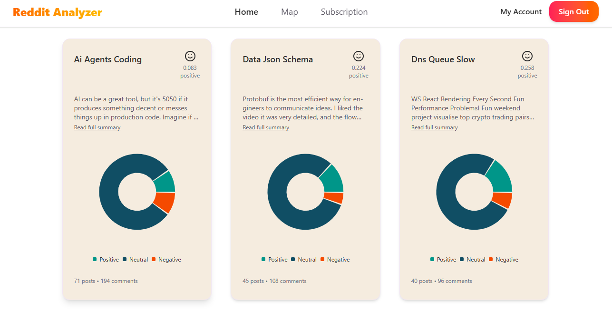
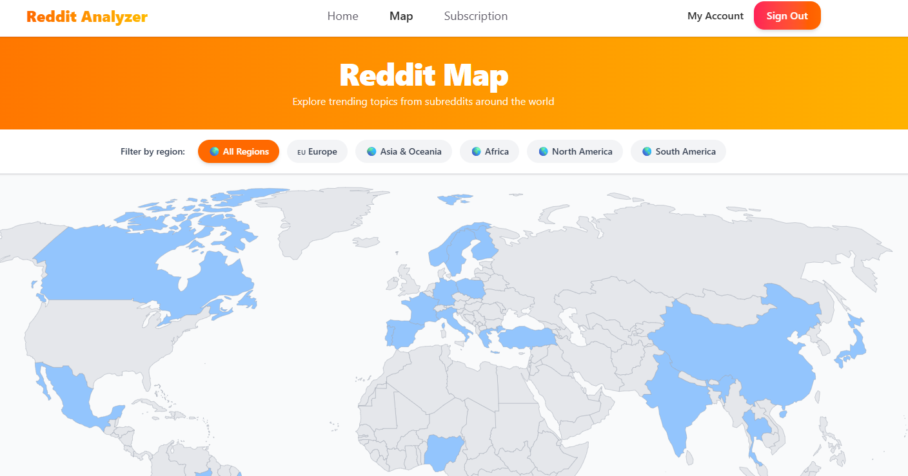
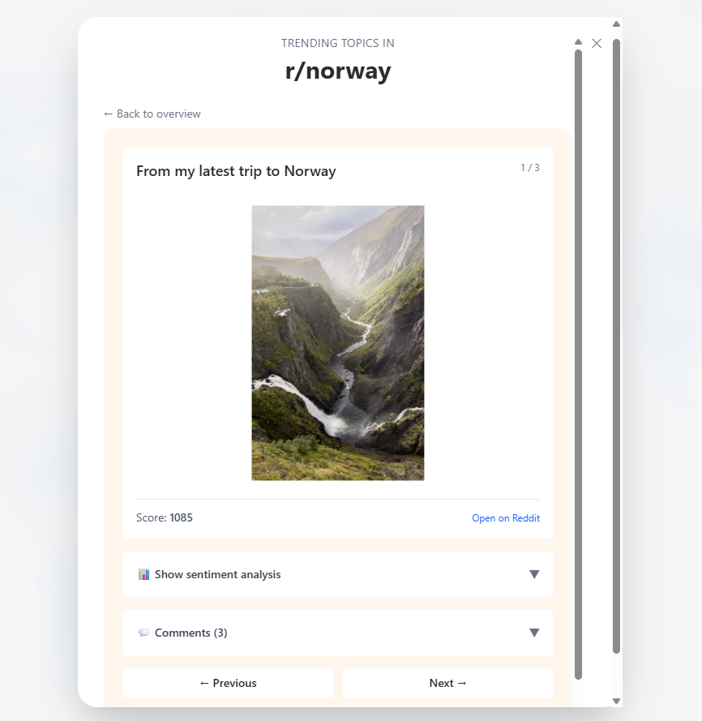
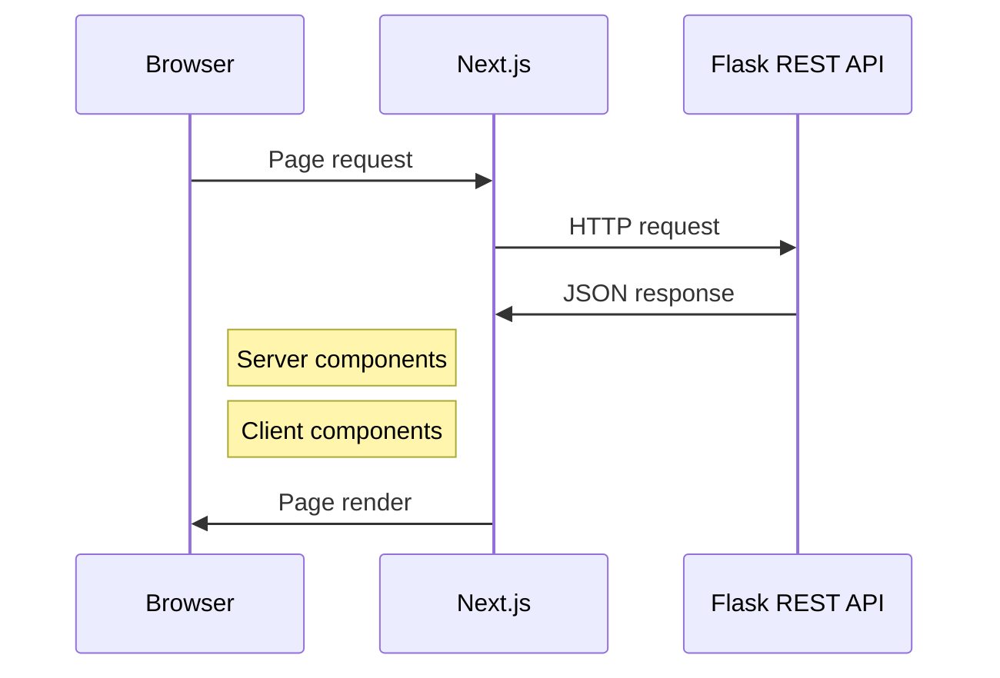
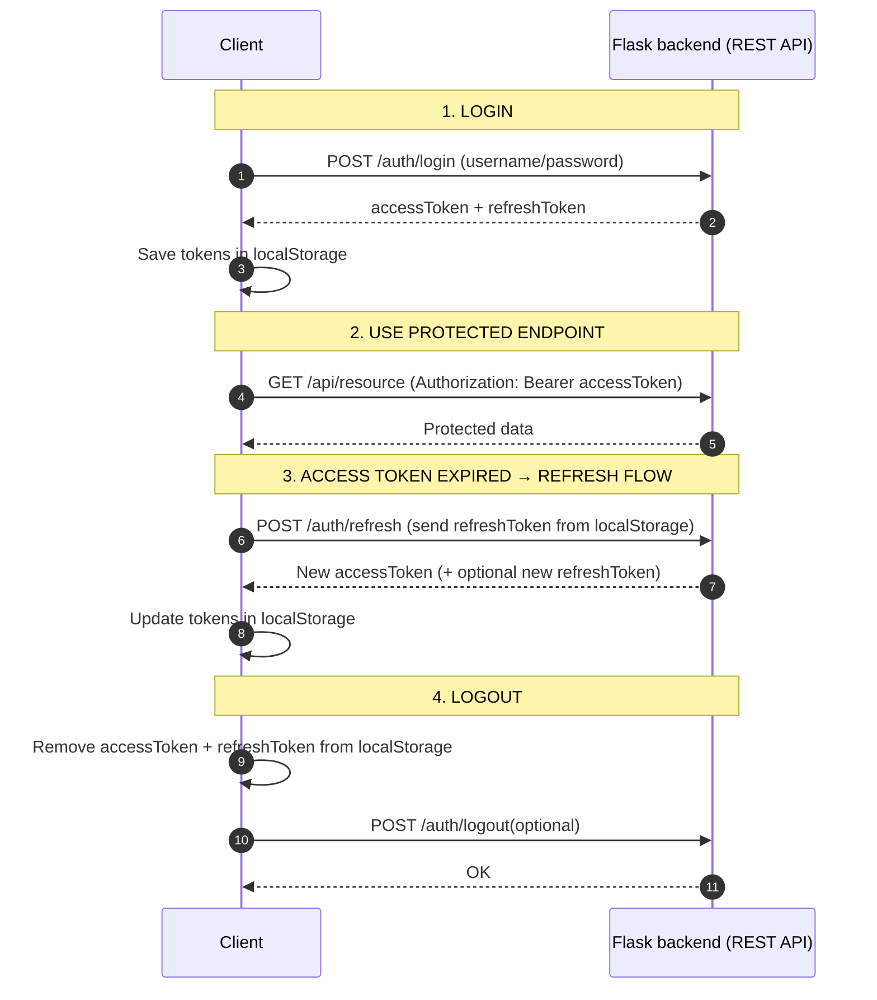

# Reddit Trend Analyzer
🔗 [Live link to the deployed application](https://reddit-analyzer-app-nine.vercel.app/)  


This is the frontend service for a web application that:
- fetches **trending Reddit topics**
- identifies **trending topics** using topic modeling
- analyzes the **sentiment** of public discussions
- and enables **filtering** topics by sentiment (positive, negative, neutral) and category (e.g., technology, entertainment, sports)

## Table of contents
>🖼️  [Screenshots](#screenshots)   
>🛠  [Tech stack](#tech-stack)  
>🚀 [Installation and dev setup](#installation-and-local-dev-setup)  
>⚡ [Configure backend fetch](#configure-fetch-functions)  
>🧩 [Project structure](#project-structure)  
>↪️ [App routing](#app-routing)  
>🌍 [World map component](#world-map-component)   
>💎 [Shadcn/ui components](#shadcnui-components)    
>🏦 [Basic architecture plan](#basic-architecture-plan)  

> [!NOTE] 
> This project was created as part of the Software Development Project II course at Haaga-Helia University of Applied Sciences, Finland. It is not affiliated with or endorsed by Reddit.

## Screenshots
<p float="left">
  <h4>Home page </h1>
  
  <h4>Trending topics </h1>
  
  <h4>World map</h1>
  
  <h4>Trending topics </h1>
  
</p>

## Tech stack

|| Tech | Description | Docs |
| :---------: | :-----------: | :-----------: |:-----------: |
| **Language** | `TypeScript` | Strongly typed language built on JS | [🔗](https://www.typescriptlang.org/) |
| **Framework** | `Next.js` | React framework with built-in routing and server-side rendering | [🔗](https://nextjs.org/docs) |
| **UI library** | `shadcn/ui`| Components built with Radix UI and Tailwind CSS |[🔗](https://ui.shadcn.com/)
| **Webpacks** | `SVGR`| Transforms SVGs into React components | [🔗](https://react-svgr.com/)


## Installation and local dev setup

Clone the repository:
```bash
git clone https://github.com/ohjelmistoprojekti-ii-reddit-app/reddit-app-frontend.git
```

Install dependencies:

```bash
npm install
```

Have the Flask backend server running and start the development server:

```bash
npm run dev
```
## API calls

### Auth
|Method| Endpoint | Description | Protected |
| :---------: | :-----------: | :-----------: | :-----------: |
| **POST** | `api/authentication/login` | Login as a user | |
| **POST** | `api/authentication/refresh` | Refresh access token |🔑 | 
| **POST** | `api/authentication/register`| Register as a user | |
| **DELETE** | `api/authentication/logout`| User logout |🔑 |
| **DELETE** | `api/authentication/delete_account`| Delete user account |🔑 |
| **GET** | `api/authentication/who_am_i`| Get current user info | 🔑|

### Subscription
|Method| Endpoint | Description |
| :---------: | :-----------: | :-----------: |
| **GET** | `api/subscriptions/type/{type}` | List of active subscriptions by analysis type = `topics` or `posts` | 
| **GET** | `api/subscriptions/current-user` | List of active subscriptions for the current user |  
| **POST** | `api/subscriptions/current-user/add/{subreddit}/{type}`| Create a new subscription for current user. Subreddit = `any subreddit`, type = `topics` or `posts` |
| **PATCH** | `api/subscriptions/current-user/deactivate`| Deactivate subscription for current user | 
| **GET** | `api/subscriptions/current-user/latest-analyzed`| Latest analyzed data for current user's active subscription |

## Project structure

```
assets/
|    └── world.svg
src/
├── app/                   # App Router
│   ├── layout.tsx         # Root layout
│   ├── page.tsx           # Homepage
│   └── (routes)/          # Grouped routes
├── components/            # React components
├── lib/                   # Utility functions
├── hooks/                 # Custom React hooks
├── styles/                # Global styles
├── tests/                 # Tests and setup
└── types/                 # TypeScript type definitions
```

## App routing
```
app 
├── /account
├── /login
├── /map
├── /register
├── /subscribe
└── /subscription
```
The app is utilizing parallel routing [read more from Next.js docs](https://nextjs.org/docs/app/api-reference/file-conventions/parallel-routes) to simultaneously render two pages within the same layout. Country specific popup/dialog page is therefore rendered per onClick on top of the world map. 

## World map component
- The world map component is a free, web-optimized SVG map from [SimpleMaps.com](https://simplemaps.com/resources/svg-maps) by Pareto Software.  
- The project is using SVGR webpack to transform the map SVG to an interactive React component. The use of SVGR is optimized in svgr.config.js.
- Located at assets/world.svg, the svg file contains path elements for each country with attributes for identification and location
```svg
<svg>
    <path id="FI" name="Finland" d="..."></path>
    ...
</svg>
```
- Styles for all countries and hover styles for selected countries are defined in styles/globals.css
```css
@layer base {
    ...
    svg path {
    @apply fill-gray-300;
    }

    #FI, #SE, #IT, #MX, #ES {
        @apply fill-orange-300;
    }

    #FI:hover, #SE:hover, #IT:hover, #MX:hover, #ES:hover {
        @apply fill-orange-500 cursor-pointer;
    }
}
```
- World.svg is imported as a React component and click behavior is programmed for selected countries
```typescript
"use client"

import WorldSvg from "./assets/world.svg"

export default function WorldMap() {
  
  const handleClick = (e: React.MouseEvent<SVGSVGElement, MouseEvent>) => {
    const target = e.target as SVGPathElement
    if (target.tagName === "path") {
      const country = clickableCountries.find(c => c.id === target.id)
      
      if(country) {
        //...
      }
    }
  }

  return <WorldSvg onClick={handleClick} />
}
```

## Shadcn/ui components
- [shadcn/ui library components](https://ui.shadcn.com/docs/components)

Already installed and reusable shadcn components can be found at:
```
src 
└── components
    └── ui
        ├── card.tsx
        └── ...
```
Install new components by choosing one from the shadcn library and executing:
```bash
npx shadcn@latest add ${componentName}
```
Newly installed components will appear in the components/ui -folder.

## Basic architecture
The frontend application handles the UI and user interaction using React. Frontend fetches and posts data via REST APIs exposed by Flask backend.

Parts of architechture diagrams and flows were produced with help of ChatGPT.


### Auth flow
