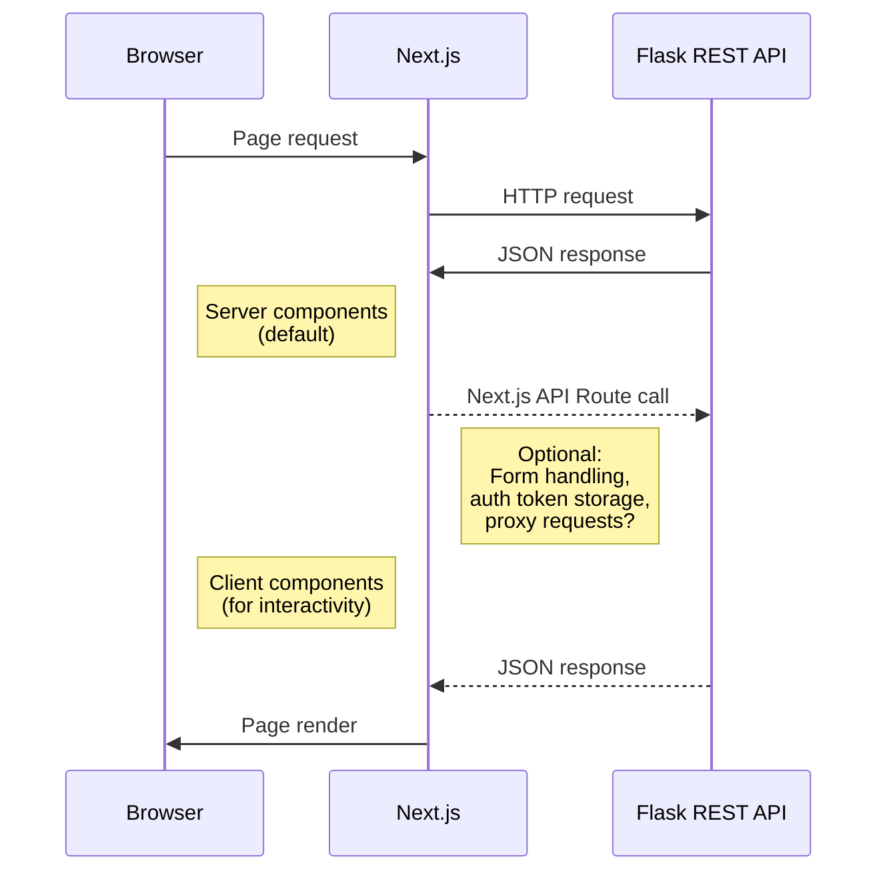

# Reddit Trend Analyzer

This is the frontend service for a web application that:
- fetches **trending Reddit topics**
- identifies **trending topics** using topic modeling
- analyzes the **sentiment** of public discussions
- and enables **filtering** topics by sentiment (positive, negative, neutral) and category (e.g., technology, entertainment, sports)

## Table of contents
>🛠 [Tech stack](#tech-stack)  
>🚀 [Installation and dev setup](#installation-and-local-dev-setup)  
>⚡ [Configure backend fetch](#configure-fetch-functions)  
>🧩 [Project structure](#project-structure-suggestion)  
>↪️ [App routing](#app-routing)  
>🌍 [World map component](#world-map-component)   
>💎 [Shadcn/ui components](#shadcnui-components)    
>🏦 [Basic architecture plan](#basic-architecture-plan)  
>⭐ [UI layout plan](#ui-layout-plan)

> [!NOTE] 
> This project was created as part of the Software Development Project II course at Haaga-Helia University of Applied Sciences, Finland. It is not affiliated with or endorsed by Reddit.

## Tech stack

|| Tech | Description | Docs |
| :---------: | :-----------: | :-----------: |:-----------: |
| **Language** | `TypeScript` | Strongly typed language built on JS | [🔗](https://www.typescriptlang.org/) |
| **Framework** | `Next.js` | React framework with built-in routing and server-side rendering | [🔗](https://nextjs.org/docs) |
| **UI library** | `shadcn/ui`| Components built with Radix UI and Tailwind CSS |[🔗](https://ui.shadcn.com/)
| **Webpacks** | `SVGR`| Transforms SVGs into React components | [🔗](https://react-svgr.com/)


## Installation and local dev setup

Clone the repository:
```bash
git clone https://github.com/ohjelmistoprojekti-ii-reddit-app/reddit-app-frontend.git
```

Install dependencies:

```bash
npm install
```

Have the Flask backend server running and start the development server:

```bash
npm run dev
```
## Configure fetch functions
Configure requests to Flask REST API with fetch functions:  
#### Fetch from Reddit API and run backend analysis models 
```typescript
// Calling Flask endpoint: 'GET /posts/hot/{subreddit}'

async function getPostsByCountry(
    subredditName: string): Promise<CountryTopPost[]> {
        //...
    }

// Example request
const posts = await getPostsByCountry("suomi");
```
```typescript
// Calling Flask endpoint: 'GET /posts/{subreddit}/{type}/{amount}'

async function getTopics(
    subredditName: string, 
    postType: string, 
    numberOfPosts: number): Promise<RedditTopic[]> {
    //...
};

// Example request
const topics = await getTopics("programming", "hot", 100);
```
> [!WARNING]
> Be mindful that the bigger the numberOfPosts, the longer the wait for frontend to render. At the moment using number of posts > 500 may cause fetch to timeout.

#### Fetch analyzed data from backend MongoDB database
```typescript
// Calling Flask endpoint: 'GET /posts/latest/{subreddit}'

async function getLatestTopicsDb(
    subredditName: string): Promise<RedditTopic[]> {
        //...
    }


// Example request
const topics = await getLatestTopicsDb("technology");
```
See available options for subredditName at [backend README](https://github.com/ohjelmistoprojekti-ii-reddit-app/reddit-app-backend#get-latest-analyzed-posts-from-the-database)

## Project structure suggestion
A best practice Next.js project structure by Binaya Bajracharya shared on [DEV Community](https://dev.to/bajrayejoon/best-practices-for-organizing-your-nextjs-15-2025-53ji) that we could follow:
```
src/
├── app/                   # App Router
│   ├── layout.tsx         # Root layout
│   ├── page.tsx           # Homepage
│   └── (routes)/          # Grouped routes
├── components/            # Shared components
│   ├── ui/                # UI components
│   └── features/          # Feature-specific components
├── lib/                   # Utility functions
├── hooks/                 # Custom React hooks
├── styles/                # Global styles
├── types/                 # TypeScript type definitions
└── context/               # React Context providers
```

## App routing
Routing at the moment:
```
app (home/trending topics -> '/')
├── layout.tsx (root layout)
├── page.tsx
|   
└── map (world map -> '/map')
    ├── layout.tsx (for accommodating @dialog parallel routing) 
    ├── page.tsx
    │
    └── @dialog (slot passed to the map layout)
        ├── default.tsx (placeholder page rendering 'null')
        └── dialog (country dialog page -> '/map/dialog?country=${subredditName}')
            └── page.tsx

```
The app is utilizing parallel routing [read more from Next.js docs](https://nextjs.org/docs/app/api-reference/file-conventions/parallel-routes) to simultaneously render two pages within the same layout. Country specific popup/dialog page is therefore rendered per onClick on top of the world map. 

## World map component
- The world map component is a free, web-optimized SVG map from [SimpleMaps.com](https://simplemaps.com/resources/svg-maps) by Pareto Software.  
- The project is using SVGR webpack to transform the map SVG to an interactive React component. The use of SVGR is optimized in svgr.config.js.
- Located at assets/world.svg, the svg file contains path elements for each country with attributes for identification and location
```svg
<svg>
    <path id="FI" name="Finland" d="..."></path>
    ...
</svg>
```
- Styles for all countries and hover styles for selected countries are defined in styles/globals.css
```css
@layer base {
    ...
    svg path {
    @apply fill-gray-300;
    }

    #FI, #SE, #IT, #MX, #ES {
        @apply fill-orange-300;
    }

    #FI:hover, #SE:hover, #IT:hover, #MX:hover, #ES:hover {
        @apply fill-orange-500 cursor-pointer;
    }
}
```
- World.svg is imported as a React component and click behavior is programmed for selected countries
```typescript
"use client"

import WorldSvg from "./assets/world.svg"

export default function WorldMap() {
  
  const handleClick = (e: React.MouseEvent<SVGSVGElement, MouseEvent>) => {
    const target = e.target as SVGPathElement
    if (target.tagName === "path") {
      const country = clickableCountries.find(c => c.id === target.id)
      
      if(country) {
        //...
      }
    }
  }

  return <WorldSvg onClick={handleClick} />
}
```

## Shadcn/ui components
- [shadcn/ui library components](https://ui.shadcn.com/docs/components)

Already installed and reusable shadcn components can be found at:
```
src 
└── components
    └── ui
        ├── card.tsx
        └── ...
```
Install new components by choosing one from the shadcn library and executing:
```bash
npx shadcn@latest add ${componentName}
```
Newly installed components will appear in the components/ui -folder.

## Basic architecture plan
The frontend application handles the UI and user interaction using React. Frontend fetches and posts data via REST APIs exposed by Flask backend.



## UI layout plan
A front page sketch of trending Reddit topics ideated by the development team and produced using ChatGPT.  
- **Trending posts** page showing top Reddit topics and displaying their sentiment based on public discussion
- **Map view** available to navigate the world map to discover the most discussed topics geographically
- **Topic search** for text search on the desired Reddit topic
- **Sign in - Sign out** for user login  

