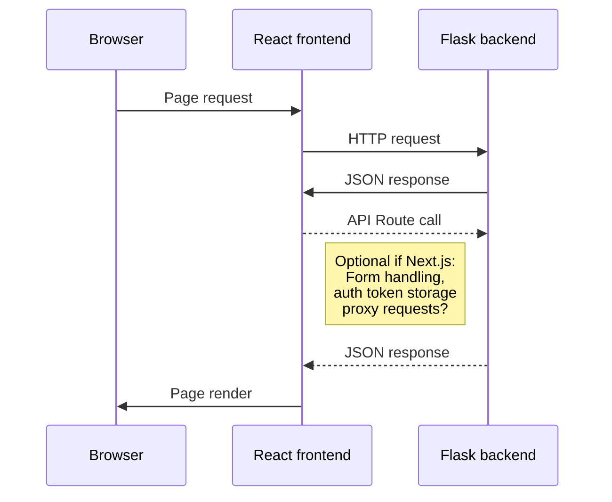

# Reddit Trend Analyzer

This is the frontend service for a web application that:
- fetches **trending Reddit topics**
- analyzes the **sentiment** of public discussions
- and enables **filtering topics by sentiment** (positive, negative, neutral)

> 🚧 This project is in early development.

## 🛠️ Tech Stack (Planned)

- **Language:** TypeScript
- **Framework:** We are choosing between **React + Vite** build tool and **Next.js** framework depending on wheter we to opt for built-in routing and server side rendering   
- **UI library:** Shadcn/ui (or Material UI) to utilize customizable components
- **Data handling:** TanStack Query or Axios

## Basic architecture
The frontend application handles the UI and user interaction using React. Frontend fetches and posts data via REST APIs exposed by Flask backend.

